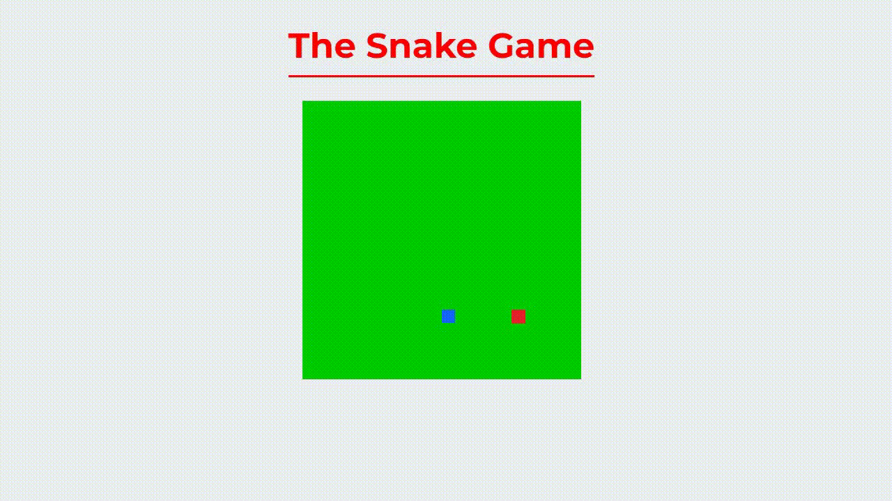

# THE SNAKE GAME

>  The Snake Game: A fun game to play while waiting for things

Check the Application: https://the-snakegame.netlify.app
## :page_facing_up: Explanation

A simple game to play while you're waiting for websites to load! Move the snake around with the arrow keys, eat the red dots to grow bigger, and avoid hitting your own tail.
## :rocket: Technologies ##

The following tools were used in this project:

- [Html](https://developer.mozilla.org/pt-BR/docs/Web/HTML/Element/html/)  
- [CSS](https://developer.mozilla.org/pt-BR/docs/Web/CSS)  
- [JavaScript](https://developer.mozilla.org/pt-BR/docs/Web/JavaScript) 
## 🤝 Collaborators

We thank the following people who contributed to this project:

<table>
  <tr>
    <td align="center">
      <a href="#">
         
        
          <b>Kayke Alves Fujinaka</b>
        
      </a>
    </td>
  </tr>
</table>

## 📝 License

This project is under license. See the [LICENSE](LICENSE.md) file for more details.

&#xa0;

<a href="#top">Back to top</a>
